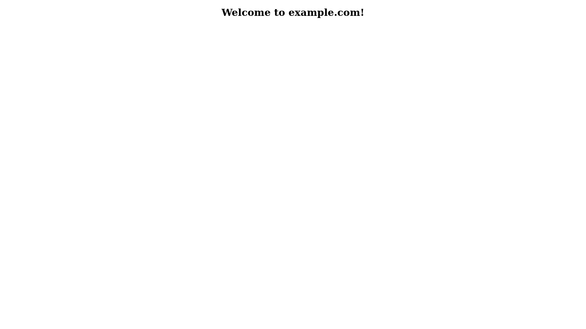

# whoami

Container displaying VIRTUAL_HOST environment variable. For [nginx-proxy](https://github.com/nginx-proxy/nginx-proxy) testing purposes.

Just run `sudo docker build . -t jsfraz/whoami:latest` to build an image, start container by `sudo docker run -d --name whoami -e VIRTUAL_HOST=example.com -e VIRTUAL_PORT=8080 jsfraz/whoami:latest` and open `example.com` in browser:

